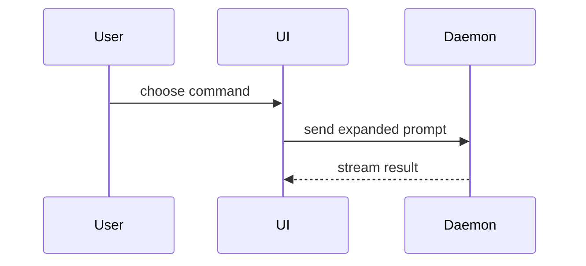

# Show me

## Contract

| Field | Bound contract |
|---|---|
| Trigger | The user says show me or diagram this about the current topic |
| Authority | Read-only: no file, VCS, credential, paid, published, deployed, or remote mutation |
| Side effect | Emits an ephemeral visual in chat; no files on disk |
| Done | One (or at most two) smallest views carrying the point, beside its short supporting text |

## Inputs

The current topic from the user prompt. The skill picks the minimal view type that answers it.

## Procedure

1. Identify the single concept the user asks to see. If the topic is too broad for one visual, ask the user to narrow it before producing more than two views.
2. Pick the smallest view that carries the point.

| The point is | View |
|---|---|
| Logic or an algorithm | Pseudocode |
| What calls what at runtime | Call tree |
| UI structure with the module boundaries that matter | Component tree |
| File responsibility or the shape of a broad refactor | Shallow file tree |
| Interaction, control flow, or data flow between parts | Diagram |
| A change against a shape that already exists | Diff |
| New code, or a shape worth copying | Whole block |

3. Render the view using the appropriate shape.

Pseudocode:

```text
on(save)
  if content is unchanged
    return cached result
  write new content
  return fresh result
```

Call tree:

```text
submitForm
  createSession
    persistPrompt
    launchAgent
  navigateToSession
```

Component tree, naming the file that owns each boundary:

```tsx
<OrderPage> (src/routes/order.tsx)
  useOrderEvents()
  <OrderToolbar>
    <RetryButton> (packages/ui)
```

Shallow file tree, one comment per directory saying what it owns:

```text
src/
├── commands/       # parses user actions
├── sessions/       # owns session state
└── transport/      # sends API requests
```

Diagram. Use Mermaid or nomnoml:



Whole block:

```python
def expand_skill(command: str) -> str:
    return f"use the {command.removeprefix('/')} skill"
```

4. Shape diffs to match the view they change: a component diff for UI changes, a file-layout diff for file organization, a call-tree diff for call-graph changes, and a pseudocode diff for control-flow changes.

Component diff:

```diff
 <OrderPage>
   useOrderEvents()
   <OrderToolbar>
+    <RetryButton />
   <OrderTimeline>
+    <RetryResultCard />
```

File-layout diff:

```diff
 src/
 ├── commands/
+│   └── show-me.ts       # expands the slash command
 ├── sessions/
-└── transport.ts
+└── transport/
+    ├── client.ts
+    └── stream.ts
```

Call-tree diff:

```diff
 submitForm
   createSession
     persistPrompt
+    expandSkillMention
     launchAgent
-  navigateToSession
+  navigateToSession
+    subscribeToEvents
```

5. Place each visual adjacent to the short supporting text, not in its own trailing block.
6. Name the file that owns each boundary in component and file trees.

## Failure and recovery
**Rendering impossible in text format.** Return the concept in prose instead of a visual.

**Topic too broad for one visual.** Ask the user to narrow the scope before generating more than two views.

**Request requires a committed diagram in a document.** Stop. This skill handles only ephemeral chat visuals. A diagram that must live in a document with a committed SVG beside its source text is outside this skill's contract.

**Request requires an interactive clickable sketch.** Stop. A layout or state comparison the user needs to click and interact with is outside this skill's contract.

**Request is a concept being taught rather than a current topic being shown.** Stop. Teaching a concept with explanation and examples is outside this skill's contract.

**Request is a visual walk of review findings one at a time.** Stop. Walking through review findings interactively is outside this skill's contract.

**Request is a multi-turn walk with the user steering each step.** Stop. A guided multi-turn exploration is outside this skill's contract.

## Output
An ephemeral visual shown inline beside its short supporting text. The visual carries the point alone; prose supplies only context the visual cannot. Nothing is written to disk.

## Provenance

Origin: odin-current, path skills/show-me/SKILL.md. Project-owned. Adaptation is clean-room: the view-selection table and shape examples are preserved as the execution mechanism; the original preamble and prose bridge are removed as redundant with the Contract section.
